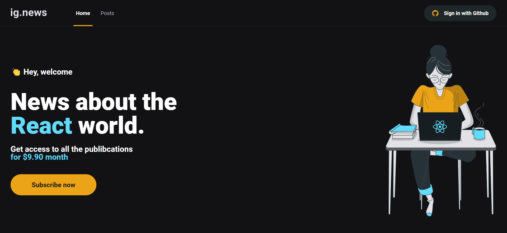
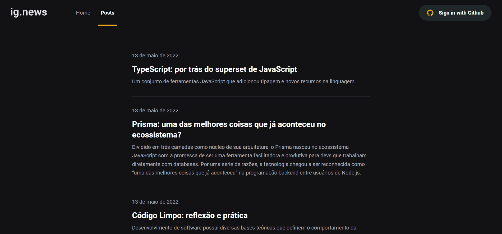
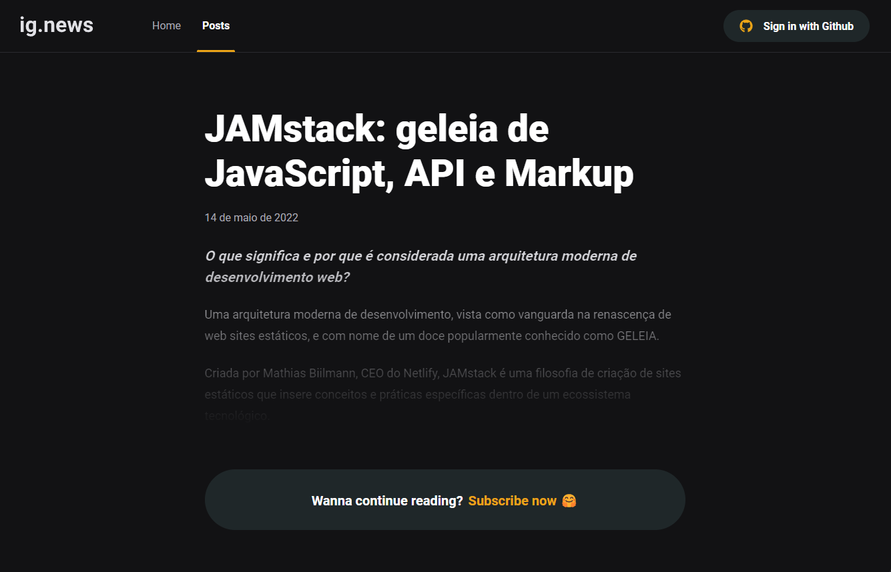
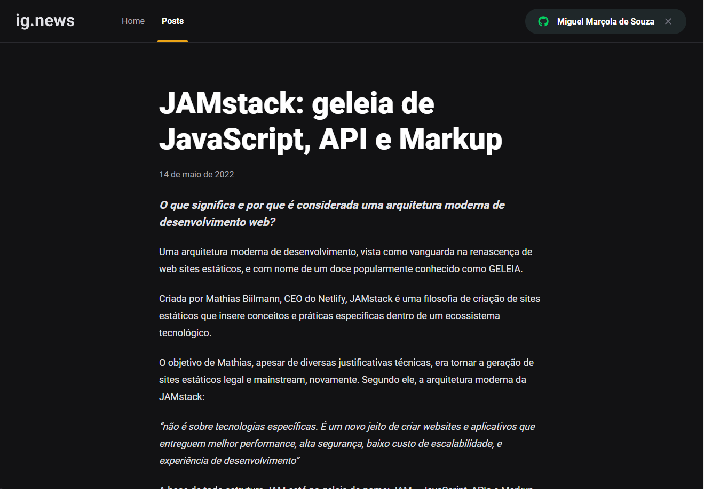

<h1 align="center">
     Ignews

</h1>

<h3 align="center">
    Blog de Notícias
</h3>

<p align="center">
  

  
  
  <a href="https://github.com/MiguelMarcola/ignews/commits/main">
    
  </a>
    
   
  
  
  
 
</p>

<h4 align="center">
	🚧   Concluído 🚀 🚧
</h4>

## 💻 Sobre o projeto

Ignews - é uma aplicação desenvolvida em React.js com Next.js e Typescript, trata-se de um blog de notícias para usuários assinantes, os usuários podem fazer login utilizando o GitHub e para acessar o conteudo completo dos posts é necessário ser um assinante da plataforma.

---

## ⚙️ Funcionalidades

- [x] OAuth com o GitHub.
- [x] Integração com api de compras do Stripe.
- [x] Integração com o Prismic CMS.
- [x] Acessa o banco de dados FaunaDB pelas funções serverless do Next.
---

## 🎨 Layout

<p align="center">

  

  

  

  

</p>

---

## 🚀 Como executar o projeto

### Pré-requisitos

Antes de começar, você vai precisar ter instalado em sua máquina as seguintes ferramentas:
[Git](https://git-scm.com), [Node](https://nodejs.org/). 
Além disto é bom ter um editor para trabalhar com o código como [VSCode](https://code.visualstudio.com/).

#### 🎲 Rodando 

```bash

# Clone este repositório
$ git clone https://github.com/MiguelMarcola/ignews.git

# Acesse a pasta do projeto no terminal/cmd
$ cd ignews

# Instale as dependências
$ npm install

# Execute a aplicação em modo de desenvolvimento
$ npm run dev

# O servidor inciará na porta:3000 - acesse http://localhost:3000

```

Para o funcionamento de todas as funcionalidades do App será necessário criar um arquivo ".env.local" na raiz do projeto contendo as variáveis de ambiente locai.

```
STRIPE_API_KEY="Chave privada da API de teste do Stripe"
NEXT_PUBLIC_STRIPE_PUBLIC_KEY="Chave pública da API do Stripe"
STRIPE_WEBHOOK_SECRET="Chave dos webhooks do stripe"

STRIPE_SUCESS_URL=http://localhost:3000/posts
STRIPE_CANCEL_URL=http://localhost:3000/

GITHUB_CLIENT_ID="Chave pública do GitHub"
GITHUB_CLIENT_SECRET="Chave privada do GitHub"


NEXTAUTH_URL=http://localhost:3000


FAUNADB_KEY="Chave privada do FaunaDB"


PRISMIC_ACESS_TOKEN="Token da API privada do Prismic"
PRISMIC_ENDPOINT="ENDPOINT do Prismic"
```

Para iniciar os webhooks do Stripe utilize no terminal o comando >>> ./stripe listen --forward-to localhost:3000/api/webhooks
## 🛠 Tecnologias

As seguintes ferramentas foram usadas na construção do projeto:

#### **Website**  ([Reactjs](https://reactjs.org/)  +  [TypeScript](https://www.typescriptlang.org/) + [Nextjs](https://nextjs.org/))

-   Sass
-   JAMStack
-   FaunaDB
-   Stripe
-   Prismic CMS

> Veja o arquivo  [package.json](https://github.com/MiguelMarcola/ignews/blob/main/package.json)

## 🦸 Autor


 <br />
 <sub><b>Miguel Marçola</b></sub></a> 🚀
 <br />

[](https://www.linkedin.com/in/miguel-mar%C3%A7ola-28535a151/) 
[](miguelmarcola@gmail.com)

---

## 📝 Licença

Este projeto esta sobe a licença [MIT](./LICENSE).

Feito com muita dedicação por Miguel Marçola 👋🏽 [Entre em contato!](https://www.linkedin.com/in/miguel-mar%C3%A7ola-28535a151/)

---

